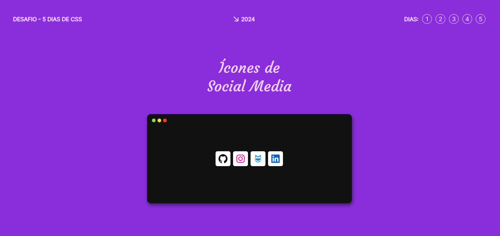
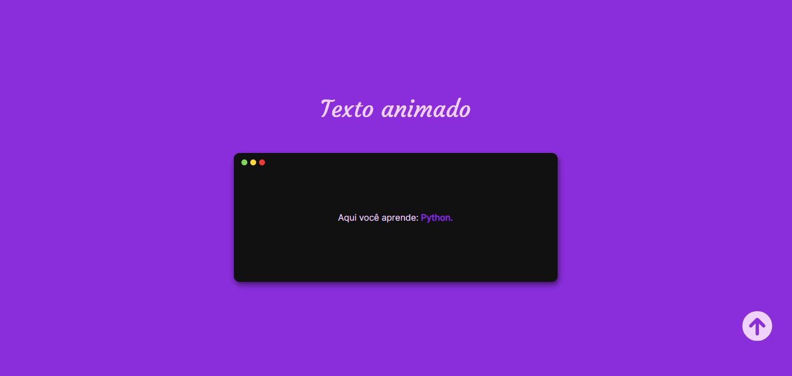
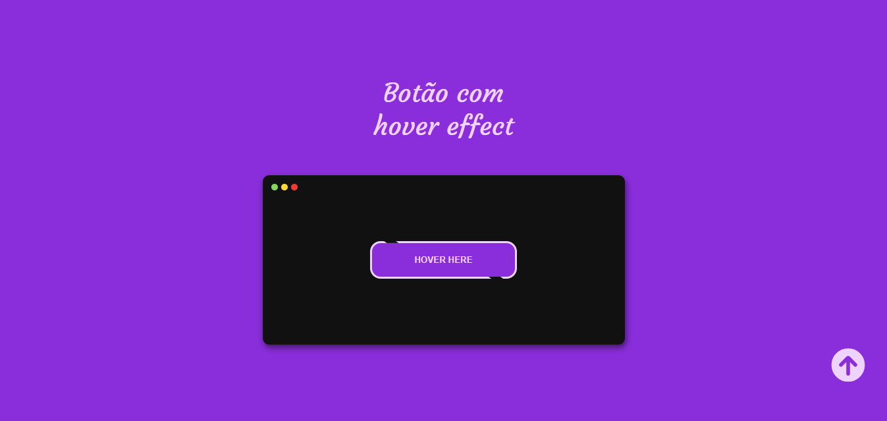
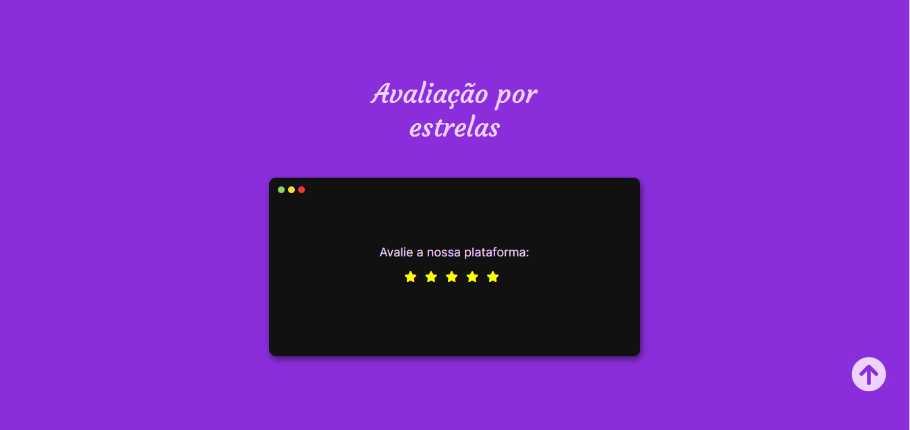
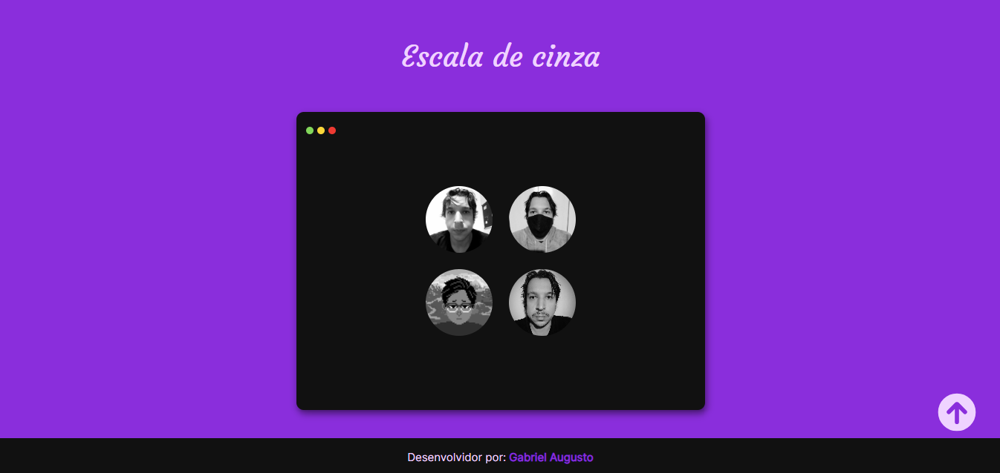

<h1 align="center">5 dias de CSS</h1>

 Desafio de 5 dias de CSS realizado pela Rocketseat no final de 2023.  

  <a href="#-tecnologias">Tecnologias</a>&nbsp;&nbsp;&nbsp;|&nbsp;&nbsp;&nbsp;
  <a href="https://github.com/gabriel-adsv/challenge-5days-css">Projeto</a>&nbsp;&nbsp;&nbsp;|&nbsp;&nbsp;&nbsp;
  <a href="https://gabriel-adsv.github.io/challenge-5days-css/" target="_blank">Layout</a>&nbsp;&nbsp;&nbsp;|&nbsp;&nbsp;&nbsp;
  <a href="#memo-licença">Licença</a>

  

 

  
  
  
  
  

## 🚀 Tecnologias
- HTML
- CSS
- JavaScript

## 💻 Projeto
Projeto idealizado para a prática avançada de CSS.
- [Acesse o projeto finalizado, online](https://gabriel-adsv.github.io/challenge-5days-css/)

## 📝 Licença
Esse projeto está sob a licença MIT.

---
Feito com ♥ by Gabriel Augusto